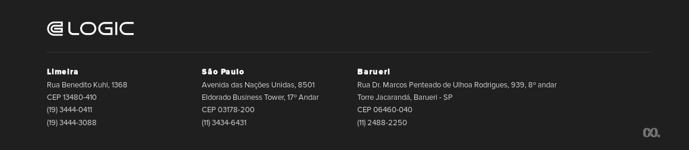

[Home](../../../ReadMe.md) :: [Módulo Treinamento](../../Modulo-Treinamento.md) :: [FU-Manter Cadastro de Clientes](../FU-Manter-Cadastro-de-Clientes.md) :: [RN-Aprovação Cadastro Clientes](RN-Aprovacao-Cadastro-Clientes.md)

# Regra de Negócios: Aprovação Cadastro Clientes

Na aprovação do cadastro básico de novos clientes é necessária a aprovação pelo **Gerente de Contas** o qual deve informar:
- Plano do Clientes (Premium ou Básico)
- Código da Conta Contábil (para efeitos de balancete/DRE)
- Limite de Compras Mensal A Prazo

O sistema deve manter (registrar) o **Gerente de Contas** que aprovou o cadastro e a data/hora da aprovação.
O campo Limite de Compras Mensal A Prazo deve aceitar somente valores iguais ao valor médio das compras mensais dos últimos 3 meses ou valor médio das compras mensais dos últimos 3 meses mais o valor definido no parâmetro sistema.financeiro.percentual_limite_compras_prazo. Sendo:
a.Limite de Compras Mensal A Prazo;
b.Limite de Compras Mensal A Prazo + sistema.financeiro.percentual_limite_compras_prazo.

**Parametrizações:**
- O Limite de Compras Mensal A Prazo é parametrável pela chave: `sistema.financeiro.percentual_limite_compras_prazo`, com valor padrão: 20 (vinte porcento). O valor mínimo para esse parâmetro é 10 e o máximo é 70.

_[Sobre o Portal de Documentação](../../../About/About.md)_

